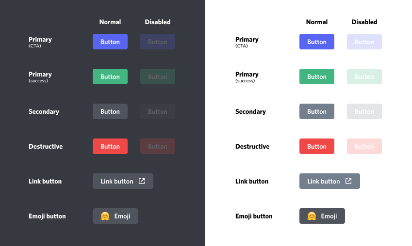
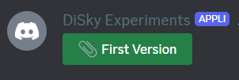
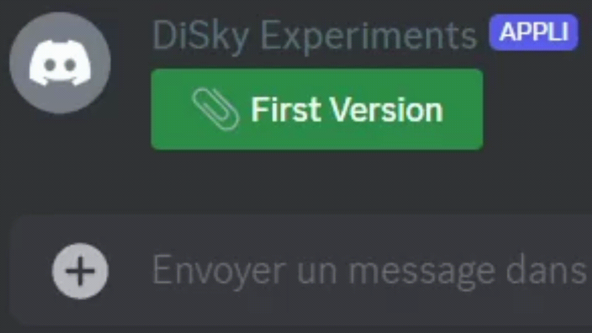

# Components

[[[% import 'macros.html' as macros %]]]

This page will include a tutorial & examples for each component available on DiSky. Keep in mind some components can only be used in a specific context!

## Understanding the layout

A component is a special element on Discord that can be interacted with. There's only two usage of components:

* In a message (with other content, or just the component)
* In a modal

There's one special component though: buttons. They do not take the whole message's width, so multiple buttons can be added within the same line.

A row (that is taking the maximum width possible) is called an **ActionRow**, and is, for instance:

* Up to 5 buttons
* One select menu/dropdown

One message can contain **up to 5 action rows**!

## Components

### Buttons

Buttons are the most common component, and can be used in a message only. They can be used to trigger an action.

There's different style and colors for buttons. Those are:



As you can see, there's 5 styles:

* Primary
* Secondary
* Success
* Danger
* Link

Plus, buttons can be enabled or disabled for each style.

#### Creating a button

First thing first, we have to create our button. Here's the different ways to do it:

=== "Primary"

    ```applescript
    set {_btn} to new primary button with id "test" named "Click me!"
    ```

=== "Secondary"

    ```applescript
    set {_btn} to new secondary button with id "test" named "Click me!"
    ```

=== "Success"

    ```applescript
    set {_btn} to new success button with id "test" named "Click me!"
    ```

=== "Danger"

    ```applescript
    set {_btn} to new danger button with id "test" named "Click me!"
    ```

=== "Link"

    ```applescript
    set {_btn} to new link button with url "https://google.com" named "Open Google!"
    ```

!!! tip "Toggle enable/disable state"
    If you want the disabled version of a button, simply add the `disabled` keyword before the `button` keyword:

    ```applescript
    set {_btn} to new disabled primary button with id "test" named "Click me!"
    ```

#### Adding a button to a message

You can use a [`rich message`](advanced-messages.md#add-components) to build a full message with content, embeds, ...

You can also use the `inline message` expression to only send the desired buttons. Here's how to do it:

```applescript
set {_btn} to new success button with id "test" named "First Version" with reaction "paperclip"
reply with rich components {_btn}
```

<figure markdown>
  
  <figcaption>The output of the code above.</figcaption>
</figure>   

#### Handling button interactions

To handle the button interactions, you can use the `on button click` event. Here's an example:

```applescript
on button click:
    
    if event-string is "test": # We check if it's the right button.
        reply with "You clicked the button!"
```

!!! success "New: Editing buttons"
    [[[ macros.required_version('4.14.2') ]]]
    
    You can directly edit the clicked buttons with a new one. Let's say you can to change its content and disable the click button, you can simply do the following:

    ```applescript
    on button click:
        
        if event-string is "test": # We check if it's the right button.
            edit button to show new disabled success button with id "test" named "Second Version" with reaction "scissors"
    ```
    
    The advantage here is that you can directly edit the button without having to edit the whole message:

    { width="300", align=center }

### Select Menu

#### The basics

First, what is a dropdown? It's a component of a message or a Discord modal where the user has a choice between several options. Recently, Discord also offers access to the choice of entities such as rooms, roles, or users.

DiSky provides two types of dropdowns: one for predefined values (string dropdown, the user has the choice between fixed values) and one for entities, it will then be up to the user to choose the roles, rooms, or users he wants to select.

#### Creating a String Dropdown

To create a simple dropdown with predefined choices, use this syntax:

```applescript
set {_dp} to new dropdown with id "test"
```

!!! warning
    Like any other component, the ID must be unique in the message.

#### Creating an Entity Dropdown

You can specify the types of entities that the user will be able to provide among the following 3:

* User
* Channel
* Role

Note that you can mix up **roles & users**, but **CAN NOT** mix channels with any other!

```applescript
set {_dp} to new entity dropdown with id "test" targeting "users" and "roles"
# OR
set {_dp} to new entity dropdown with id "test" targeting "channels"
```

#### Changing properties

We can modify some properties of our dropdown, regardless of its type, such as:

* Minimum values (`set min range of {_dp} to 1`)
* Maximum values (`set max range of {_dp} to 2`)
* Placeholder (`set placeholder of {_dp} to "Select a role ..."`)

!!! info
The placeholder is what is shown before opening the dropdown itself!
It tells what the user is asked for.

#### Adding choices (String Dropdown)

If your dropdown is a string dropdown, then you can add **options** that the user will be able to select. Each option comes with a:

* Name, what is shown on Discord. <mark style="color:red;">Required.</mark>
* Value, is not shown on Discord, but will be returned once the user completes the interaction. <mark style="color:red;">Required</mark>
* Emoji, also shown on Discord. <mark style="color:green;">Optional.</mark>
* Description, also shown on Discord. <mark style="color:green;">Optional.</mark>

Here's an example code to add an option:

```applescript
add new option with value "value" named "A choice .." with description "Chose wisely!" with reaction "joy" to options of {_dp}
```

!!! warning
    The value specified in an option **cannot be found in another option**, they are unique, like IDs!

#### Handling dropdown interactions

Now out dropdown is sent, users can interact with them. There are two separate events for the two types of dropdowns (string and entity). In both cases, however, you can use `event-dropdown` to retrieve the identifier of the dropdown used.

!!! warning
    Don't forget to **reply or defer** those interactions!

!!! example ""
    === "String dropdown"
    
        ```applescript
        on dropdown click:
        ```
    
        !!! success ""
            You can use `selected values` to get the values the user selected inside of this event.
    
    === "Entity dropdown"
    
        ```applescript
        on entity dropdown click:
        ```
    
        !!! success ""
            You can use `selected entities` to get the roles, channels and/or users selected inside of this event.

!!! success "New: Editing dropdowns"
    [[[ macros.required_version('4.14.2') ]]]
    
    You can directly edit the clicked dropdown with a new one. Let's say you can to change its content and disable the click dropdown, you can simply do the following:

    ```applescript
    on dropdown click:
        
        if event-string is "test": # We check if it's the right dropdown.
            set {_newDp} to new dropdown with id "test"
            set placeholder of {_newDp} to "You chose %selected values%"
            add new option with value "value" named "A choice .." with description "Chose wisely!" with reaction "joy" to options of {_newDp}
            edit dropdown to show {_newDp}
    ```