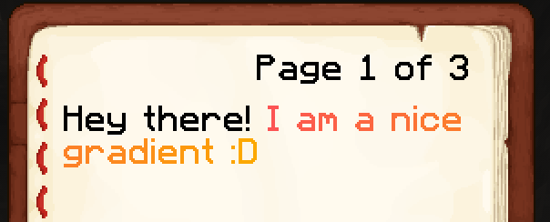
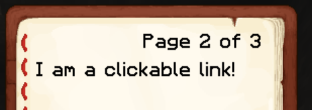

# ✨ Creating a book

A Minecraft book is composed of an author, a title and **pages**. Each page can be formatted using **MiniMessage**'s formatting, and can contain clickable links, hover effect and more.

## Create the book

First, let's create the book itself. You can use the following expression to do so:

```applescript
set {_book} to a new book with title "My Book" and author "ItsTheSky" #(1)!
```

1. You can use **[MiniMessage's formatting](https://docs.advntr.dev/minimessage/format.html)** here too! For instance:

    ```applescript
    set {_book} to a new book with title "<gradient:red:blue>My Title" and author "&6Its&cThe&9Sky"
    ```

!!! tip
    You can replace any `book` in the elements of the addon by `boosk` to avoid conflicts with other addons!

## Add pages

Now, we can add pages to our book. One element added to the pages represent one actual page of the book!

```applescript
# First page (with gradient)
add "Hey there! <gradient:red:gold>I am a nice gradient :D</gradient>" to pages of {_book}

# Second page (with clickable link)
add "I am a <click:suggest_command:/say Hello!>clickable link</click>!" to pages of {_book}

# Third page (with hover effect)
add "I am a <hover:show_text:'&cI am a hover effect!'>hover effect</hover>!" to pages of {_book}
```

??? tip "Enhance the process with lists"
    You can use **lists** to simply the process of adding pages to a book:

    ```applescript
    add "First line" to {_pages::*}
    add "Second line" to {_pages::*}
    # ...
    add (join {_pages::*} with nl) to pages of {_book}
    ```
    
    We'll just join, at the end, all the elements with a new line. Smart, right?

## Open the book

You can finally open the book to one or more players, using the following effect:
    
```applescript
open book {_book} to player
```

## Result

This code will have the following results:

=== "First page"
    

=== "Second page"
    

=== "Third page"
    

## Give the book

Optionally, you can give the book as an item to a player. You can use the following expression to convert your book into a Skript's item:

```applescript
set {_item} to book {_book} as item

# ... and then for instance:
# give {_item} to player 
```
