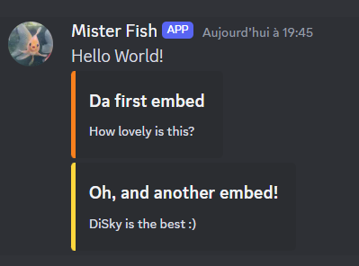

# Webhooks

[[[% import 'macros.html' as macros %]]]
[[[ macros.required_version('4.15.0') ]]]

!!! tips 
    Webhooks were only available via a separate [module](../modules/webhooks.md) before version 4.15.0, but now they are built into the core addon. Please consider updating your syntax to the new one!

Webhooks are a way to send messages to a channel without a bot. They are useful for sending messages from external services or scripts, as they don't require a bot to be online. You can also use them to send messages with a custom name and avatar, which is not possible with a bot.

There's two main "types" of webhooks in DiSky:

- **Webhook Clients**: Registered webhooks that you can use to send messages.
- **(Normal) Webhooks**: Webhooks retrieved from a channel, you cannot send messages with them.

In this page, you'll see how to register your webhooks and send messages with them, but you can see information about managing webhooks in a channel [just below](#manage-webhooks).

## Webhooks Clients

### Register a client

You first need to register a webhook client to use it later. For this, create a **webhook** in a channel using the following steps:

1. Open the **settings** of your desired **channel**.
2. Navigate to the **integrations** tab.
3. Click on **Create Webhook**.
4. Fill in the **name** and **avatar** of the webhook :material-information-outline:{ title="You'll be able to change those in code!" }
5. Copy the **webhook URL**, you'll need it for the next step.

Then, you can register the webhook client using the following effect:

!!! abstract "Where do I put this code?"
    The best place is in a [`on ready`](../getting-started/2-bot-loading.md#2-ready-sections) section of your bot. That way, it only registers once, and you can directly use the `event-bot` provided by the section!

```applescript
# We assume you're in a 'on ready' section here
register webhooks using event-bot named "my_webhook" with url "https://discord.com/api/webhooks/XXXXXX"
```

A few notes here:

- You must use a **loaded bot** as "bridge" to register the webhook.
- The `name` is the name you'll use to refer to this webhook client later. It's only for DiSky, not for Discord.
- The `url` is the URL you copied earlier, containing both the webhook's ID and token.

### Send a message

The message sending workflow was greatly improved in 4.15.0 compared to the module, as it integrates smoothly with DiSky's existing syntax. For instance, you can directly use a [rich message](advanced-messages.md) as the message to send!

```applescript
create a new message and store it in {_msg}:
    set the content of the message to "Hello World!"
    
    make embed and store it in {_e}:
        set title of embed to "Da first embed"
        set embed color of embed to orange
        set footer of embed to "How lovely is this?"
    add {_e} to the embeds of the message
    
    make embed and store it in {_e}: #(1)!
        set title of embed to "Oh, and another embed!"
        set embed color of embed to yellow
        set footer of embed to "DiSky is the best :)"
    add {_e} to the embeds of the message
    
make client "my_webhook" post {_msg} with username "Mister Fish" with avatar url "https://cdn.pfps.gg/pfps/2128-fish-6.png" and store it in {_msg}
```

!!! danger "Important Note"
    Only **webhook** can send **multiple embeds** in a single message. If you try to send multiple embeds with a **bot**, it will only send the last one!

The code above will send the following message:

<figure markdown>
  
  <figcaption>Amazing, right?</figcaption>
</figure>

---

## Manage Webhooks

### Retrieve Webhooks

You can **retrieve** webhooks, by channels or guilds. You can use [this effect](../docs/effects.md#retrieve-webhooks):

=== "By channel"
    ```applescript
    retrieve webhooks of event-channel and store them in {_webhooks::*}
    ```

=== "By guild"
    ```applescript
    retrieve webhooks of event-guild and store them in {_webhooks::*}
    ```

!!! example "List Guild's Webhooks"
    ```applescript
    discord command webhooks:
        prefixes: ?
        trigger:
            retrieve webhooks of event-guild and store them in {_webhooks::*}
            
            add "%size of {_webhooks::*}% webhooks found:" to {_m::*}
            loop {_webhooks::*}:
                add "- %discord name of loop-value% (%discord id of loop-value% in %mention tag of (text channel of loop-value)%)" to {_m::*}
            reply with join {_m::*} with nl
    ```

### Webhook Properties

Here's a non-exhaustive list of what you can do with a webhook:

* Get its [name](../docs/expressions.md#name-of-discord-entity), [channel](../docs/expressions.md#messagewebhook-channel), [guild](../docs/expressions.md#guild-of), [ID](../docs/expressions.md#discord-id), [created at](../docs/expressions.md#creation-date)
* [Delete](../docs/effects.md#destroy-discord-entity) it